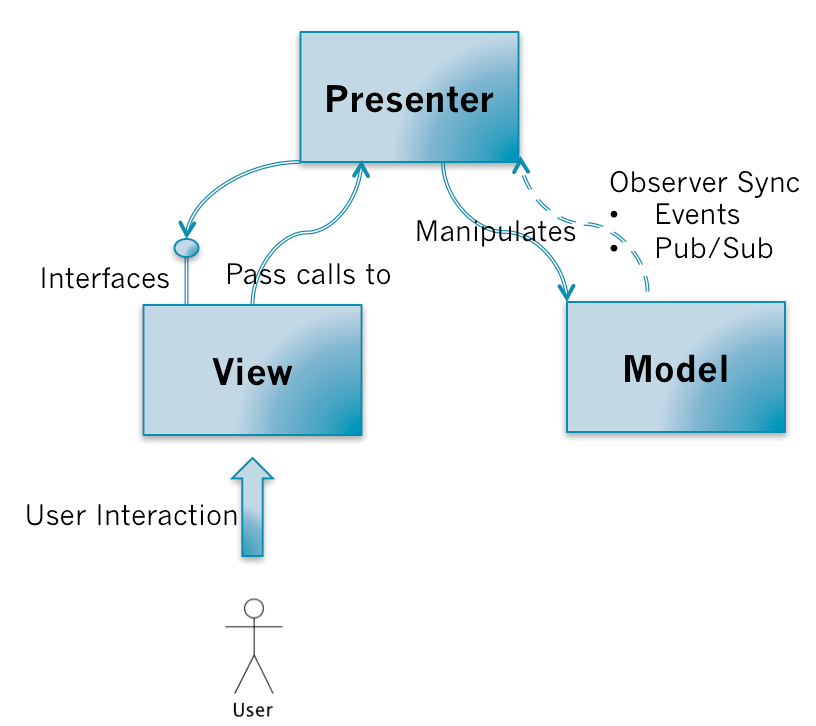

# MVC模式

## View、Model、Controller

View

管理用户界面的层次

Model

提供数据操作的接口，执行相应的业务逻辑

Controller

进行Model和View之间的协作（路由、输入预处理等）的应用逻辑（application logic）

## MVC的调用关系

用户的对View操作以后，View捕获到这个操作，会把处理的权利交移给Controller（Pass calls）

Controller会对来自View数据进行预处理、决定调用哪个Model的接口，然后由Model执行相关的业务逻辑

当Model变更了以后，会通过观察者模式（Observer Pattern）通知View

View通过观察者模式收到Model变更的消息以后，会向Model请求最新的数据，然后重新更新界面

需要特别关注的关键点：

- View是把控制权交移给Controller，Controller执行应用程序相关的应用逻辑（对来自View数据进行预处理、决定调用哪个Model的接口等等）
- Controller操作Model，Model执行业务逻辑对数据进行处理。但不会直接操作View，可以说它是对View无知的。
- View和Model的同步消息是通过观察者模式进行，而同步操作是由View自己请求Model的数据然后对视图进行更新。

Model的更新是通过观察者模式告知View的，具体表现形式可以是Pub/Sub或者是触发Events。通过观察者模式的好处就是：不同的MVC三角关系可能会有共同的Model，一个MVC三角中的Controller操作了Model以后，两个MVC三角的View都会接受到通知，然后更新自己。保持了依赖同一块Model的不同View显示数据的实时性和准确性。

## MVC的优缺点

### 优点

- 把业务逻辑和展示逻辑分离，模块化程度高。且当应用逻辑需要变更的时候，不需要变更业务逻辑和展示逻辑，只需要Controller换成另外一个Controller就行了（Swappable Controller）
- 观察者模式可以做到多视图同时更新

### 缺点

- Controller测试困难。因为视图同步操作是由View自己执行，而View只能在有UI的环境下运行。在没有UI环境下对Controller进行单元测试的时候，应用逻辑正确性是无法验证的：Model更新的时候，无法对View的更新操作进行断言。
- View无法组件化。View是强依赖特定的Model的，如果需要把这个View抽出来作为一个另外一个应用程序可复用的组件就困难了。因为不同程序的的Domain Model是不一样的

## MVP模式

MVP模式把MVC模式中的Controller换成了Presenter。MVP打破了View原来对于Model的依赖，其余的依赖关系和MVC模式一致。

### MVP的调用关系

和MVC模式一样，用户对View的操作都会从View交移给Presenter。Presenter会执行相应的应用程序逻辑，并且对Model进行相应的操作；而这时候Model执行完业务逻辑以后，也是通过观察者模式把自己变更的消息传递出去，但是是传给Presenter而不是View。Presenter获取到Model变更的消息以后，通过View提供的接口更新界面。

关键点：

- View不再负责同步的逻辑，而是由Presenter负责。Presenter中既有应用程序逻辑也有同步逻辑
- View需要提供操作界面的接口给Presenter进行调用

对比在MVC中，Controller是不能操作View的，View也没有提供相应的接口；而在MVP当中，Presenter可以操作View，View需要提供一组对界面操作的接口给Presenter进行调用；Model仍然通过事件广播自己的变更，但由Presenter监听而不是View。

### MVP的优缺点

#### 优点

- 便于测试。Presenter对View是通过接口进行，在对Presenter进行不依赖UI环境的单元测试的时候。可以通过Mock一个View对象，这个对象只需要实现了View的接口即可。然后依赖注入到Presenter中，单元测试的时候就可以完整的测试Presenter应用逻辑的正确性。
- View可以进行组件化。在MVP当中，View不依赖Model。这样就可以让View从特定的业务场景中脱离出来，可以说View可以做到对业务完全无知。它只需要提供一系列接口提供给上层操作。这样就可以做到高度可复用的View组件。

#### 缺点

- Presenter中除了应用逻辑以外，还有大量的View->Model，Model->View的手动同步逻辑，造成Presenter比较笨重，维护起来会比较困难。

## MVVM模式

MVVM可以看作是一种特殊的MVP（Passive View）模式，或者说是对MVP模式的一种改良。

MVVM代表的是Model-View-ViewModel。

可以简单把ViewModel理解为页面上所显示内容的数据抽象，和Domain Model不一样，ViewModel更适合用来描述View。

### MVVM的调用关系

MVVM的调用关系和MVP一样。但是，在ViewModel当中会有一个叫Binder，或者是Data-binding engine的东西。以前全部由Presenter负责的View和Model之间数据同步操作交由给Binder处理。你只需要在View的模版语法当中，指令式地声明View上的显示的内容是和Model的哪一块数据绑定的。当ViewModel对进行Model更新的时候，Binder会自动把数据更新到View上去，当用户对View进行操作（例如表单输入），Binder也会自动把数据更新到Model上去。这种方式称为：Two-way data-binding，双向数据绑定。可以简单而不恰当地理解为一个模版引擎，但是会根据数据变更实时渲染。

也就是说，MVVM把View和Model的同步逻辑自动化了。以前Presenter负责的View和Model同步不再手动地进行操作，而是交由框架所提供的Binder进行负责。只需要告诉Binder，View显示的数据对应的是Model哪一部分即可。

### MVVM的优缺点

#### 优点

- 提高可维护性。解决了MVP大量的手动View和Model同步的问题，提供双向绑定机制。提高了代码的可维护性。
- 简化测试。因为同步逻辑是交由Binder做的，View跟着Model同时变更，所以只需要保证Model的正确性，View就正确。大大减少了对View同步更新的测试。

#### 缺点

- 过于简单的图形界面不适用，或说牛刀杀鸡
- 对于大型的图形应用程序，视图状态较多，ViewModel的构建和维护的成本都会比较高
- 数据绑定的声明是指令式地写在View的模版当中的，这些内容是没办法去打断点debug的

## 总结

可以看到，从MVC->MVP->MVVM，就像一个打怪升级的过程。后者解决了前者遗留的问题，把前者的缺点优化成了优点。