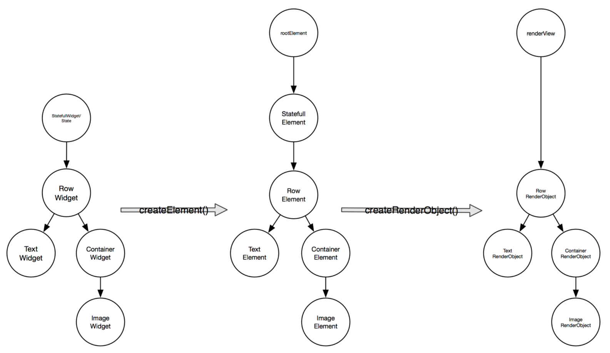
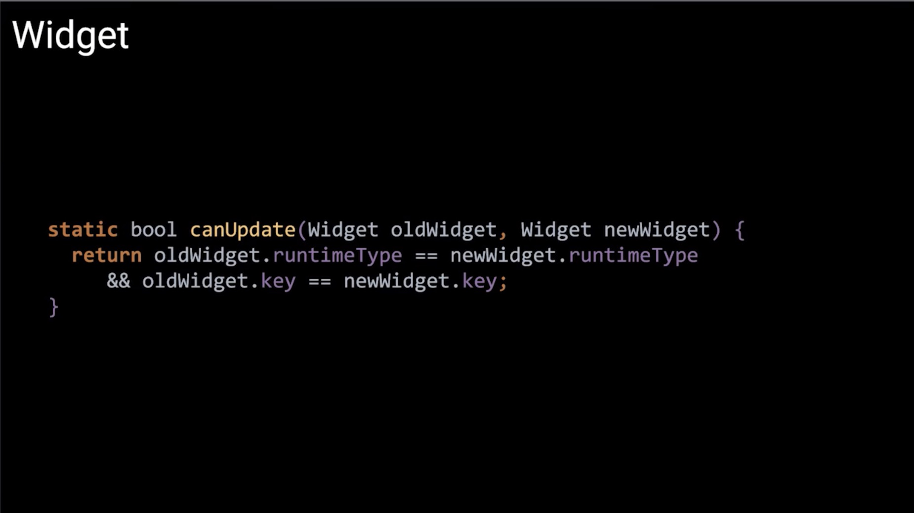
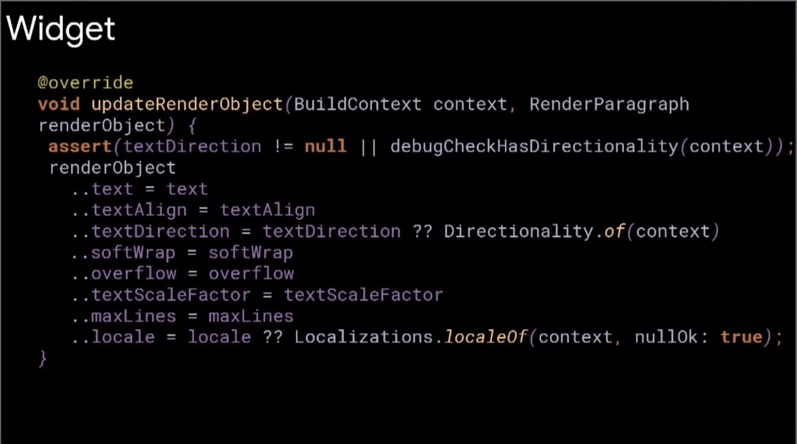
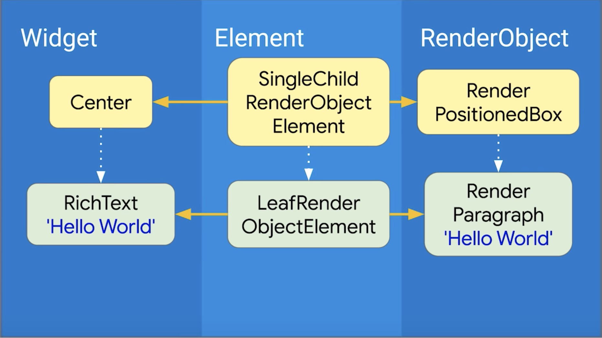
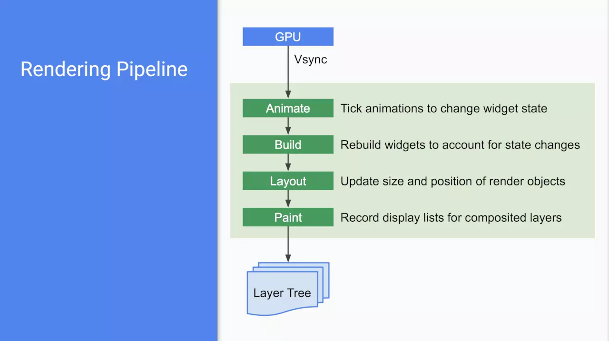

# performance

A widget is an immutable description of part of a user interface.

Flutter has three trees:

- Widget
- Element
- RenderObject

Flutter 作为响应式框架，在渲染过程中，存在三棵树。
Widget 树仅仅用来存放渲染内容和布局信息等描述信息，不能直接渲染出界面。Element 树与 web 的虚拟 DOM 类似， 由 Widget 树创建，存放了部件信息的上下文，同时持有 Widget 和 RenderObject。RenderObject 树由 Element 树生成，根据 Widget 的布局属性进行布局，绘制 Widget 传入的内容。

因为 Widget 树仅用来配置相关数据，因此构建开销是很小的。对于StatelessWidget，每次重新 new 就行；对于 StatefulWidget， 调用 state.setState() 方法，触发更新。

Widget: describes the configuration for an Element.

Element: an instantiation of a Widget at particular location in the tree.

RenderObject: handles size, layout, and painting.

| Widget | Element | RenderObject |
| :--: | :--: | :--: |
| Configure | Life Cycle | Paint |
| hold properties; offer a public API | hold a spot in the UI hierarchy; manage parent/child relations | size and paint itself; lay out children; claim input event |
| Foo | FooElement | RenderFoo |
| holds config for a pieceof of the UI; has a public API | represents an actual piece of the UI; holds refs, manages trees | knows about size, layout, painting, and compositing |

## StatefulWidget

widget stores mutable state.

<https://api.flutter.dev/flutter/widgets/StatefulWidget-class.html>
的`Performance considerations`部分

将状态存在更高层的 widget 里面，<https://flutter.dev/docs/development/ui/widgets-intro> <https://github.com/caijw/flutter_demo/blob/master/app2/lib/main.dart>，示例中，ShoppingListItem

### reuse the state

When the widget is first inserted into the tree, the framework calls the createState() function to create a fresh instance of _XXXState to associate with that location in the tree. (Notice that subclasses of State are typically named with leading underscores to indicate that they are private implementation details.) When this widget’s parent rebuilds, the parent creates a new instance of ShoppingList, but the framework reuses the _XXXState instance that is already in the tree rather than calling createState again.

### state accesses the properties of the current XXXWidget

the _XXXState can use its widget property. If the parent rebuilds and creates a new XXXWidget, the _XXXState rebuilds with the new widget value. If you wish to be notified when the widget property changes, override the didUpdateWidget() function, which is passed as oldWidget to let you compare the old widget with the current widget.

### signal to the framework that it changed its internal state

wraps those calls in a setState() call. Calling setState marks this widget as dirty and schedules it to be rebuilt the next time your app needs to update the screen. If you forget to call setState when modifying the internal state of a widget, the framework won’t know your widget is dirty and might not call the widget’s build() function, which means the user interface might not update to reflect the changed state. By managing state in this way, you don’t need to write separate code for creating and updating child widgets. Instead, you simply implement the build function, which handles both situations.

### Responding to widget lifecycle events

#### initState

After calling createState() on the StatefulWidget, the framework inserts the new state object into the tree and then calls initState() on the state object. A subclass of State can override initState to do work that needs to happen just once. For example, override initState to configure animations or to subscribe to platform services. Implementations of initState are required to start by calling super.initState.

When a state object is no longer needed, the framework calls dispose() on the state object. Override the dispose function to do cleanup work. For example, override dispose to cancel timers or to unsubscribe from platform services. Implementations of dispose typically end by calling super.dispose.

## RenderObjectWidget

<https://api.flutter.dev/flutter/widgets/RenderObjectWidget-class.html>

## RenderObject

<https://api.flutter.dev/flutter/rendering/RenderObject-class.html>

## RenderObjectElement

<https://api.flutter.dev/flutter/widgets/RenderObjectElement-class.html>

## State

<https://api.flutter.dev/flutter/widgets/State-class.html>

## setState

<https://api.flutter.dev/flutter/widgets/State/setState.html>

## point

### jank的优化

dart线程是单线程

<https://xinlei.dev/2019/10/27/flutter-%e6%80%a7%e8%83%bd%e4%bc%98%e5%8c%96-%e5%a6%82%e4%bd%95%e9%81%bf%e5%85%8d%e5%ba%94%e7%94%a8-jank/>

### 性能测试

- 更新状态时，影响范围尽可能地少。
- 仅当必要时才更新状态。
- 不要在 build 方法中进行密集型计算任务，理想的话，把这些操作放在 main isolate 之外

is this optimization worth the maintenance overhead?

对于大多数性能优化的问题来说，它们的答案统统指向了这句话——“它究竟取决于什么？”。对于特定 Widget 是否值得进行特定优化，并付出维护成本？在特定情况下的特殊处理是否合理？对于这些问题唯一有用答案是测试和测量。量化每个选择对性能的影响，并根据该数据做出决定。

Basic advice

- 不要在 DEBUG 模式下测量性能。只有 profile 模式下才能测量其性能。
- 在真机上测试，不要在 Android 或者 iOS 模拟器上测试。虽然模拟器软件非常适合开发使用，但是它们在性能表现上和真机差异非常大。Flutter 不允许在模拟器上以 profile 模式运行，因为这并没有任何意义。这种方式收集的性能数据并不是实际的性能。理想的情况下是使用相同物理设备。让它作为你专用的性能测试机，并不再用于其他用途。
- 学习 Flutter 性能分析工具<https://flutter.dev/docs/perf/rendering/ui-performance>

## the flutter rendering pipeline

Thesis: Simple is Fast

- One-pass, linear-time layout and painting
- Simple box contraints can generate expressive layout
- Structural repainting using compositing

